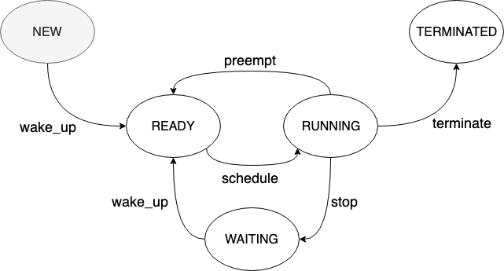

<p align="center">
    <a href="https://coveralls.io/github/giacomodeliberali/typed-state-machine" alt="Coverage status">
        </a>
    <a href="https://travis-ci.org/giacomodeliberali/typed-state-machine" alt="Build Status">
        </a>
</p>

# Typed State Machine

A library to describe finite state machine (aka DFAs). 

<p align="center">
    
</p>

```typescript
tsm = await new TypedStateMachine({
    // minimal setup: initial state and transitions
    initialState: ThreadStateType.New,
    transitions: [
        new Transition({
            from: ThreadStateType.New,
            to: ThreadStateType.Ready,
            name: "wake_up"
        }),
        new Transition({
            from: ThreadStateType.Ready,
            to: ThreadStateType.Running
            name: "schedule"
        }),
        new Transition({
            from: ThreadStateType.Running,
            to: [
                ThreadStateType.Ready,
                ThreadStateType.Waiting,
                ThreadStateType.Terminated
            ]
        }),         
        new Transition({
            from: ThreadStateType.Waiting,
            to: ThreadStateType.Ready,
            name: "wake_up",

            //optional transition events
            onBeforeTransition: (tsm) => console.log(tsm.getState()),
            onAfterTransition: (tsm) => console.log(tsm.getState())
        })
    ],

    // general state events
    onStateEnter: (tsm, state) => console.log(`Entered in state ${ThreadStateType[state]}`),
    onStateLeave: (tsm, state) => console.log(`Left state ${ThreadStateType[state]}`),

    // general transition events
    onAfterEveryTransition: (tsm, from, to) => console.log(`After transition ${ThreadStateType[from]} -> ${ThreadStateType[to]}`),
    onBeforeEveryTransition: (tsm, from, to) => console.log(`Before transition ${ThreadStateType[from]} -> ${ThreadStateType[to]}`),

    // specific state async hooks
    hooks: [
        {
            state: ThreadStateType.Running,                 // state for this hooks
            handlers: [
                {
                    hookType: StateHookType.OnBeforeEnter,  // 4 possible values
                    handler: () => checkResources()         // returns Promise<boolean>
                }
            ]
        }
    ]
}).initialize();
```

Transit by name:
```typescript
tsm.getState(); // ThreadStateType.New

await tsm.transitByName("wake_up")  // ThreadStateType.Ready

await tsm.transitByName("schedule") // ThreadStateType.Running

await tsm.transitByName("stop")     // ThreadStateType.Waiting

await tsm.transitByName("wake_up")  // ThreadStateType.Ready

// ...

```

## Note

Please note that this project is under active development and is **not ready for use**.

## Roadmap
- [ ] Improve source code (refactoring)
    - [ ] Find a better way to make sync and async hooks compatible
        - Maybe divide function in version to keep strong types? Eg.
            - `transit()`: sync, throw error if it finds an async hook in the current resolution
            - `await transitAsync()` // ok for both sync and async hooks
            - `transitByName()`
            - `await transitByNameAsync()`
            - `goto()`
            - `await gotoAsync()`
    - [ ] Refactor `HookFunction<T>`to something more significant
    - [ ] Consider remove `new Transition({})` in favour of `{}`like other options  
    - [ ] Add other utility methods:
        ```typescript
        tsm.bindHook(StateType.A, (hookType: StateHookType) => {
            if(hookType == StateHookType.OnBeforeLeave){
                // ...
            }
        });
        ```
    - [x] Transit by name (with context-awareness)
        ```typescript
        tsm.transit("transitionName")
        ```
    - [ ] Add options to ignore hooks and events
        ```typescript
        tsm.transit(MyState.NewState, invokeLifecycles: bool)
        ```
    - [ ] Keep track of previous states
        ```typescript
        tsm.back();
        tsm.forward();
        ```
    - [ ] Add more information in fired events
        ```typescript
        transition.onBeforeTransition(tsm: TypedStateMachine, from: T, to: T);
        transition.onAfterTransition(tsm: TypedStateMachine, from: T, to: T);
        ```
- [ ] Improve unit test organization
- [ ] Add support to decorate an enum with reflect-metadata
    ```typescript
        enum StateType {

            @Transition({
                to: [
                    StateType.Inactive,
                    StateType.Paused
                ]
            })
            Active,

            @Transition({ ... })
            Paused,

            @Transition({ ... })
            Inactive,

            @Transition({ ... })
            Stopped
        }

        const tsm = new TypedStateMachine(StateType);

        tsm.bindHook(StateType.A, (hookType: StateHookType) => {
            if(hookType == StateHookType.OnBeforeLeave){
                // ...
            }
        });
    ```
- [ ] Add pluggable modules
    - [ ] History
    - [ ] Visualization
    - [ ] ...